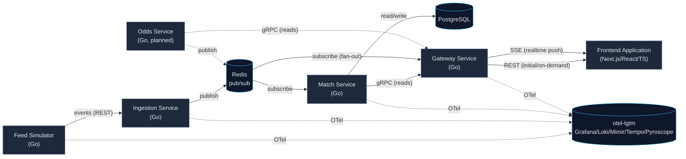

# Architecture

## Overview

MatchFlow is composed of a small number of independent services that
together simulate, ingest, distribute, and display live sports match
events. The architecture favors clarity over completeness: each service
has one responsibility, and communication patterns are chosen to give
engineers practice with both request/response and event distribution
styles.

```
Feed Simulator -> Ingestion Service -> Redis -> Match Service
                                                     |
                                              Gateway Service
                                                     |
                                          Frontend Application
```



Frontend never talks directly to Match Service, Ingestion Service, or
Redis - only through the Gateway.
Dashed edges to `OBS` are cross-cutting observability (Phase 6), not the request path.
The dashed `Odds Service` node is not built yet - it's shown to make explicit that a second domain
service joins the system the same way Match Service does: publish to Redis, expose reads over
gRPC, no new fan-out mechanism required (see
[Multi-service realtime fan-out](#multi-service-realtime-fan-out) below).

## Services

### Feed Simulator

Simulates third-party sports data providers. Produces live match events
and generates realistic event streams for the rest of the system to
consume. Exists so the system has a continuous, believable source of
events without depending on a real external provider.

### Ingestion Service

Receives incoming events from the Feed Simulator (or any future event
source). Validates incoming data, normalizes event payloads into a
consistent internal shape, and publishes events for downstream
consumers. Acts as the boundary between "whatever shape external data
arrives in" and "the shape the rest of the system relies on."

### Match Service

Maintains current match state, built from the event stream. Exposes
match-related APIs and provides match information to other services.
The system of record for "what is currently true about a match."

Exposes reads two ways: REST (via Huma, its original client-facing shape) and gRPC (via
connect-go, added for the Gateway's synchronous queries - see
[Communication Patterns](#communication-patterns)). Both stay - the REST API was already built,
tested, and works; there's no reason to remove it just because the Gateway needs a typed gRPC
contract too.

### Gateway Service

The entry point for client applications. Exposes REST APIs, provides
real-time communication endpoints, and distributes updates to connected
clients. Owns the client-facing contract, so internal service changes
don't necessarily ripple to clients.

The Gateway is the bridge between internal event distribution and the
browser: Redis pub/sub is a server-to-server protocol only, a browser
never subscribes to it directly. The Gateway holds the Redis
subscription and re-emits each message down its own connections to
clients.

**Server-Sent Events (SSE) is the default realtime protocol**, not
WebSocket. Match/odds updates only need to flow one way (server to
client) - the frontend never needs to push data back over the same
channel - so SSE's plain-HTTP, auto-reconnecting model fits without the
extra complexity of a WebSocket's full-duplex upgrade handshake.
WebSocket is a reasonable future upgrade only if a bidirectional need
shows up (e.g. a client-initiated action that must ride the same
connection); until then it's unnecessary surface area.

Redis pub/sub delivers to whoever is subscribed at publish time and
keeps nothing - a client that reconnects mid-match has missed whatever
was published while it was disconnected. The Gateway is responsible for
backfilling current state from the Match Service's API on (re)connect,
rather than assuming Redis has anything to replay.

### Multi-service realtime fan-out

More than one backend domain service will eventually publish updates that the same client
needs: Match Service today, an Odds Service later.
The Gateway subscribes directly to Redis on each domain's channel and multiplexes them into one
SSE stream per client, rather than each domain service pushing to the Gateway over its own
gRPC stream.

This is a deliberate choice, not the default because it was already there.
A gRPC server-streaming RPC per domain service was considered - it would mean the Gateway
holding a persistent stream per upstream service just to re-multiplex what a broker already does
for free, and a new persistent connection to manage and reconnect per service as the service
count grows.
A dedicated aggregation/fan-out tier in front of the Gateway was also considered - that pattern
(e.g. Fastly's Fanout) earns its cost at millions-of-concurrent-connections, multi-region scale;
at MatchFlow's scale the Gateway already is that edge tier, so a second tier would be a layer
introduced for a scaling problem that doesn't exist yet.

Broker-side fan-out to a single edge tier is also how comparable real systems are built, not
just the cheapest option available here: a documented real-time betting platform built on
Confluent/Kafka has domain services publish odds updates onto topics, with one edge layer
(Ably) subscribing across topics and fanning out per client - domain services never talk to the
edge layer or to individual clients directly ([Confluent: Building a Real-Time Betting Platform
with Confluent Cloud and Ably](https://www.confluent.io/blog/real-time-betting-platform-with-confluent-cloud-and-ably/)).
Betfair's own client-facing Stream API follows the same shape at the edge: one stream, many
market subscriptions multiplexed over it, an initial full snapshot followed by deltas
([Betfair: Market & Order Stream API - How it works](https://support.developer.betfair.com/hc/en-us/articles/360000402291-Market-Order-Stream-API-How-does-it-work)) -
worth mirroring in the Gateway's own SSE payload shape (a full match/odds snapshot on connect,
deltas after) independent of the transport question.
The synchronous/asynchronous split lines up with general industry guidance too: gRPC (or
synchronous RPC generally) for request/response paths, a broker for downstream event
distribution and fan-out
([iGaming Platform Microservices Architecture Guide](https://www.babble.uk.com/igaming-platform-microservices-architecture/)) -
which is exactly the Gateway's split between gRPC reads from Match Service and a direct Redis
subscription for realtime push.

**Why SSE, not WebSocket, even for a betting-adjacent feed.** Betting/exchange systems often
reach for WebSocket, but mainly because their channel is bidirectional (placing or cancelling an
order over the same connection) or latency-critical in a way a pure score/odds push isn't.
SSE is proven at real production scale for one-way feeds specifically: Shopify's BFCM Live Map
served 323 billion events over millions of concurrent SSE connections at sub-300ms latency,
choosing SSE over WebSocket precisely because the feed was one-way
([Shopify Engineering: Using Server-Sent Events to Simplify Real-time Streaming at
Scale](https://shopify.engineering/server-sent-events-data-streaming)). MatchFlow's Gateway feed
is one-way (score/odds push, no client-initiated action riding the same connection), so SSE
stays the right default; WebSocket remains the documented upgrade path in
[Gateway Service](#gateway-service) above if a bidirectional need appears.

**Talking to Match Service over gRPC.** The Gateway is a REST/SSE
service on its client-facing side and a gRPC client on its backend
side - the same "gateway fronting typed internal services" shape shows
up in most systems that split a public HTTP API from internal RPC.
Three pieces make that translation clean rather than ad hoc:

- **A resolver layer** that converts between the Gateway's REST/JSON
  request and response shapes and Match Service's protobuf messages.
  This is the only place either vocabulary is known to the other -
  route handlers work in REST shapes, gRPC client code works in
  protobuf shapes, and the resolver is the seam between them.
- **gRPC-to-HTTP error translation** - a gRPC status code
  (`NOT_FOUND`, `INVALID_ARGUMENT`, ...) maps to an HTTP status
  (`404`, `400`, ...) in one place, so every route doesn't hand-roll
  its own mapping.
- **Service addresses via environment variable**, defaulting to plain
  `localhost:<port>` for now - every other cross-service address in
  this repo (`REDIS_URL`, `POSTGRES_DSN`) already defaults the same
  way, since no service has run anywhere but locally or in the
  Compose/Kind dev loops yet. A Kubernetes-DNS-shaped hostname (e.g.
  `match-service.matchflow.svc.cluster.local:<port>`) becomes the
  override once a real deployment manifest sets it (Phase 8, see
  [ROADMAP.md](ROADMAP.md)) - one config surface either way, not a
  hardcoded address baked into either environment.

### Frontend Application

Displays matches, live events, and current match state. Consumes the
Gateway Service's REST and realtime APIs. The only service with a
human-facing UI.

Built with Next.js (App Router) and React/TypeScript. Expected shape:

- **Server-rendered match views** - match lists and match detail pages are
  fetched server-side from the Gateway's REST API, so an initial page load
  doesn't depend on the realtime channel being connected yet.
- **A realtime client layer** - once loaded, the page opens a connection to
  the Gateway's realtime endpoint and applies incoming event updates to
  the already-rendered match state (e.g. score changes, new events),
  rather than re-fetching on every update.
- **Route structure by access pattern** - grouping routes by whether they
  need a live connection (a match-in-progress view) versus a static
  snapshot (a completed match's summary) is a reasonable default; the
  concrete grouping is left to the engineer building it.
- **A thin API/client boundary** - all calls to the Gateway (REST and
  realtime) go through one client module, so the transport detail (which
  realtime protocol, which REST paths) isn't scattered across components.

As with the backend services, implementation detail (state management
choice, exact folder layout, component library) is left open. The
constraint that matters architecturally is the one above: the frontend
talks to the system only through the Gateway Service, never directly to
Match Service, Ingestion Service, or Redis.

## Communication Patterns

- **Feed Simulator -> Ingestion Service**: event submission over REST
  (via Huma).
- **Ingestion Service -> Redis**: event publication for distribution.
- **Match Service**: consumes distributed events from Redis to update
  state; exposes that state via REST (existing) and gRPC (for the Gateway) to other services.
- **Gateway Service -> Match Service**: synchronous reads (list matches, get a match, backfill
  on connect) over gRPC/[connect-go](https://connectrpc.com/) - a typed contract for
  request/response queries.
- **Gateway Service -> Redis**: direct subscription to each domain service's publish channel
  (`matchflow:events` today, an Odds Service channel later) for realtime fan-out - see
  [Multi-service realtime fan-out](#multi-service-realtime-fan-out).
- **Gateway Service -> Frontend Application**: REST for initial/on-demand
  data (server-rendered pages, one-off queries), Server-Sent Events (SSE)
  as the default realtime channel for push updates applied client-side
  after load (see [Gateway Service](#gateway-service)).

## Protobuf & gRPC Structure

Locked in ahead of the Gateway/Match Service gRPC work (Phase 4, see
[ROADMAP.md](ROADMAP.md)) so it's built once, not guessed at per-service later:

- **`proto/matchflow/<service>/v1/*.proto`** - source protobuf definitions (`syntax = "proto3"`),
  one directory per service that exposes a gRPC API.
- **`gen/go/<service>_v1/`** - generated Go stubs, checked in rather than
  generated on every build (so a checkout builds without also invoking
  the proto toolchain). Regenerated via a single command when a
  `.proto` file changes.
- **One repo, not a separate protobuf repo.** A dedicated repo for
  proto definitions makes sense at a scale where many independent teams
  consume the same contracts across repo boundaries - two devs and four
  services in one repo don't have that problem, and a separate repo
  would just be a second place to keep in sync with every API change.
- **Codegen tool: [buf](https://buf.build/).** buf is now the mainstream
  default for new Go protobuf projects - checked-in, versioned config
  (`buf.yaml`/`buf.gen.yaml`), lint, and breaking-change detection against
  a base branch, none of which plain `protoc` provides on its own. The
  one real reason a project avoids buf - its compiler reimplementing new
  protobuf language features (e.g. proto edition 2024) later than Google's
  own `protoc` - doesn't apply here, since this repo targets plain
  `syntax = "proto3"`, which buf has supported natively for years.
- **RPC framework: [connect-go](https://connectrpc.com/) (`connectrpc.com/connect`).**
  Generated from the same `.proto` files via buf, but the generated
  service also speaks plain HTTP/JSON in addition to gRPC and gRPC-Web -
  used only for the Gateway's synchronous reads from Match Service (see
  [Communication Patterns](#communication-patterns)), not for realtime
  fan-out (see [Multi-service realtime fan-out](#multi-service-realtime-fan-out)).
  connect-go is stable and used in production, including by Buf itself.

## Cross-Cutting Concerns

- **Observability**: every service emits traces, metrics, and logs via
  OpenTelemetry, regardless of its role in the request path.
- **Concurrency**: event ingestion and distribution are expected to
  handle concurrent event streams; this is a deliberate practice area,
  not an edge case.
- **Testability**: service boundaries are drawn so each service can be
  tested in isolation, with integration tests validating the
  boundaries between them.
- **Publisher/consumer schema coupling**: the event payload published to
  Redis and the shape the Gateway decodes for its realtime stream must
  agree. A drift between them (a renamed field, a changed type) tends to
  fail silently rather than loudly - a single decode failure on one
  malformed field can drop the entire message, and a stream that still
  looks "connected" gives no signal that events are being lost. Treat
  the published event shape as a contract between Ingestion/Match
  Service and the Gateway, not an implementation detail either side can
  change unilaterally.

## Guiding Principles

- Scalability: services scale independently; state is held by the
  service that owns it (Match Service), not smeared across the system.
- Maintainability: one responsibility per service, explicit contracts
  between them.
- Observability: instrumentation is a first-class concern, not an
  afterthought bolted on later.
- Testability: boundaries are drawn to be testable, both in isolation
  and end-to-end.
- Developer experience: local setup, running, and iterating on any
  single service should be fast and low-friction.

## Future Enhancements

These are explicitly out of scope for the initial build, but are
plausible next steps once the core system is working:

- **Kafka / RabbitMQ / NATS** - a dedicated message broker, if Redis-based
  distribution outgrows its use case (e.g. durable/replayable event logs).
- **Service mesh** - if inter-service traffic management (retries,
  circuit breaking, mTLS) becomes complex enough to warrant it.
- **Terraform** - for managing cloud infrastructure as code, once
  deployment targets extend beyond a single Kubernetes cluster.
- **ArgoCD** - for GitOps-style continuous deployment, once there's a
  deployment pipeline mature enough to benefit from it.
